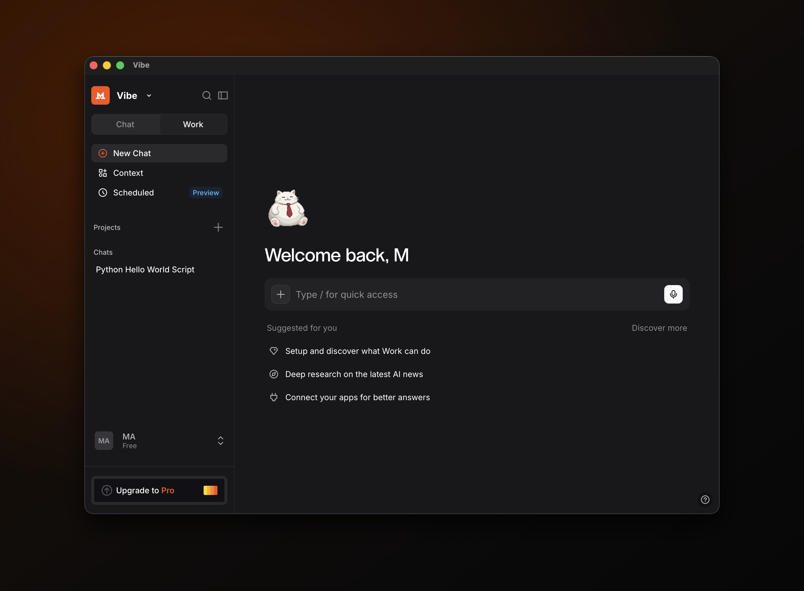

# Mistral Vibe for macOS

A native macOS desktop app for [Mistral Vibe](https://chat.mistral.ai/) (formerly Le Chat), built without Electron.

It wraps the Vibe web app in the system `WKWebView`, so it uses macOS's
built-in WebKit instead of shipping a copy of Chromium. The result is a real
`.app` that launches instantly, keeps you signed in, and weighs a fraction of a
typical web wrapper.

<p align="center">
  
</p>

| | |
|---|---|
| **Engine** | System WebKit (`WKWebView`) — no bundled browser |
| **Architecture** | Universal — Apple Silicon and Intel |
| **Minimum OS** | macOS 12 (Monterey) |

---

## Install

1. Download the latest `Vibe.dmg` from the
   [**Releases**](../../releases/latest) page.
2. Open the `.dmg` and drag **Vibe** into **Applications**.

The app is signed ad-hoc rather than with an Apple Developer ID, so the first
launch needs Gatekeeper's approval:

1. Open **Vibe** from Applications. macOS will refuse the first time.
2. Go to **System Settings → Privacy & Security**, scroll down, and click
   **Open Anyway**.
3. Confirm. macOS remembers the choice for future launches.

---

## Features

- Stays signed in across launches (persistent cookie and local storage).
- Native menu bar with the shortcuts you expect — reload, history, full screen,
  and standard editing commands.
- File uploads through the native open panel; downloads land in `~/Downloads`.
- Links to Vibe and its sign-in providers stay in the app; everything else
  opens in your default browser.
- Closing the window keeps the app running in the Dock with your session
  intact; reopen it from the Dock icon, or quit with Command-Q.
- Window size and position are remembered between sessions.

---

<details>
<summary><b>Build from source (for developers)</b></summary>

<br>

Requires the Swift toolchain that ships with Xcode or the Command Line Tools
(`xcode-select --install`).

Build the app bundle into `build/`:

```sh
./scripts/build.sh
```

Run it:

```sh
open build/Vibe.app
```

Build the installer (`dist/Mistral-<version>.dmg`):

```sh
./scripts/make-dmg.sh
```

Both scripts produce a universal binary by default. To target a single
architecture, set `ARCHS`:

```sh
ARCHS="arm64"  ./scripts/build.sh    # Apple Silicon only
ARCHS="x86_64" ./scripts/build.sh    # Intel only
```

### Project layout

```
Sources/main.swift      The entire app — window, web view, menus, downloads
Resources/Info.plist    Bundle metadata (identifier, version, icon)
scripts/build.sh        Compile and assemble Vibe.app
scripts/make-dmg.sh     Build the app and package it into a .dmg
scripts/make-icon.sh    Generate the app icon (Resources/AppIcon.icns)
```

### Configuration

Common adjustments live at the top of [`Sources/main.swift`](Sources/main.swift):

- **Home URL and in-app hosts** — the `Config` enum.
- **Default window size** — the `1100 × 760` values in `loadView` and
  `applicationDidFinishLaunching`.

The icon is generated from an inline SVG in
[`scripts/make-icon.sh`](scripts/make-icon.sh). Edit the SVG, delete
`Resources/AppIcon.icns`, and rebuild. For the sharpest result install
[librsvg](https://formulae.brew.sh/formula/librsvg) (`brew install librsvg`);
otherwise the script falls back to the system QuickLook renderer.

</details>

---

## Notes

This is an unofficial wrapper. It loads the Vibe website and nothing more —
all functionality, accounts, and terms of service belong to Mistral.

To distribute the app to other Macs without the Gatekeeper prompt, sign it with
an Apple Developer ID and notarize it. The local build is intentionally
dependency-free and needs no developer account.

---

## License

[MIT](LICENSE)
